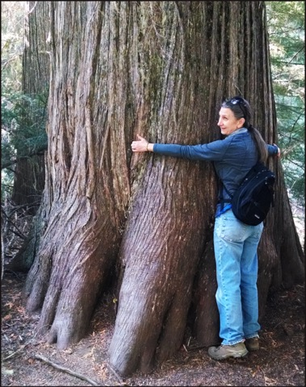

# Be patient either way
(42)
#inbox

Rather you find yourself in good or bad circumstances, be patient. “Either way” points to practicing patience when things are hard but not forgetting to practice when they are not. Patience with equanimity. See all circumstances as transient. Good ones fall apart and bad ones are opportunities. It is funny that we tend to attach to things that _fall apart_ (impermanent situations) and try to distance ourselves from life's _opportunities_ (circumstances we consider bad). Always be patient because when things _fall apart, opportunities_ will arise and visa-versa. These are the constant fluctuations of cyclic existence.

Wait, with equanimity, what ever the case, good or bad. Whatever happens. Look at what that is. Patience is the ballast for the vessel that is your life. Slowly improve 1% at a time. Be better than before.

It is hard to be undistracted and practice steadily. You lose your bearings. Don't let your practice be swayed by the tenor of the current situation no matter if good or bad. Situations unfold at their own speed. Impatience is being closed off to the flow of life.

'There is a Zen story about a man whose horse ran away. People said it was bad luck. Then the horse came back, which people thought was good luck, and then his son broke his leg while falling off it and people thought that was bad luck come round again. But because his leg was broken, the man’s son was saved from fighting and dying in a war, and the cycle went on and on.'

Endure whichever situation arises, good or bad. Things change. Good turns bad and bad turns good. "We’ll see" is the operative mood here. In the mean time, focus on awaking mind.

----------------------------------------------------------------

Proficiency comes when practicing even when distracted  ........[[201903210523]]
Every encounter suddenly becomes the path ......................[[201903150533]]
Be true to the principled one ..................................[[201903190550]]
Train without bias .............................................[[201904160516]]
To Soon To Say .................................................[[202009211958]]

#### Alternate Titles
- Whichever of the two occurs, be patient
- Whichever of the two arises, be patient
- Be patient with whichever of the two arises
- Whichever of the opposites occurs, be patient
- Bear whichever the two occurs
- Don't judge your practice on external circumstances

----------------------------------------------------------------
04-10-2019 - 5:07 AM
›[[201904100507]]
→ #slogans

